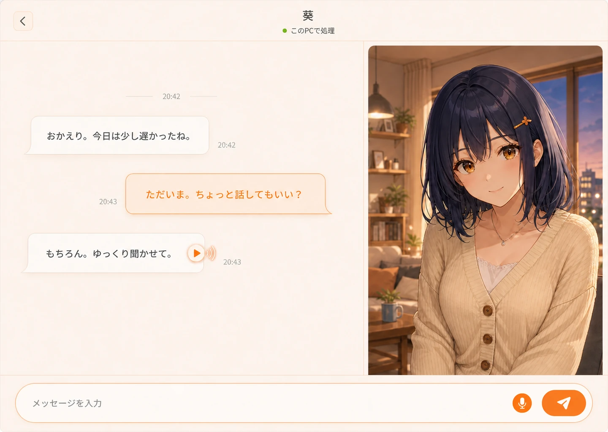
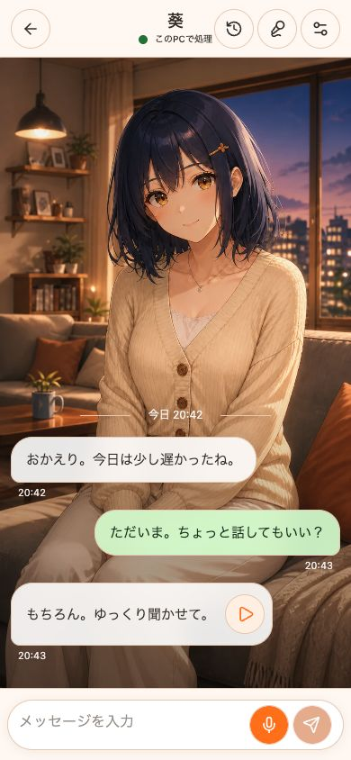

# mikan chat デザイン仕様・フロントエンド設計

> Status: MVP design baseline
>
> Last updated: 2026-08-30
>
> Primary language: 日本語 / Secondary language: English

## 1. この文書の役割

`DESIGN.md` は、mikan chatの画面を実装するときの判断基準です。色や余白だけでなく、UIキットの使い方、コンポーネントの境界、PCからスマートフォンへ展開するときに守る構造まで定めます。

実装中にモックとこの文書が食い違った場合は、次の順で優先します。

1. ユーザーが承認した最新モック
2. この `DESIGN.md`
3. UIキットの初期スタイル

UIキットの見た目を、そのまま製品デザインとして採用しません。

## 2. 製品の見え方

mikan chatが目指すのは、ライトユーザー向けの手軽でちょうどいいAIキャラクターチャットシミュレーターです。

画面上の主役は、AIモデルや推論設定ではなく、ユーザーが入り込めるシナリオと会話です。ローカルLLM、API、ブラウザ音声認識、Hayamimi、Irodori TTSは体験を支える基盤として扱い、必要になるまで技術用語を見せません。

### デザイン原則

1. **シナリオから選ぶ**

   ホームでは知らないキャラクター名より、状況、関係性、舞台を先に見せます。キャラクター画像はシナリオへ入るための視覚的な入口として使います。

2. **技術を隠して状態を伝える**

   「OpenAI互換エンドポイント」より「このPCで処理」「接続済み」を先に表示します。

3. **温かいが、幼くしすぎない**

   アイボリーとみかん色を中心に、余白と日本語組版で落ち着きを作ります。装飾のためのグラデーション、過度な丸み、絵文字は使いません。

4. **一画面一目的**

   ホームはシナリオを選ぶ、トークは会話する、設定は接続を整える、という単位を崩しません。

5. **PCで始め、縦長の体験資産を残す**

   PC版のキャラクター表示は、将来のスマートフォン版へそのまま持ち込める9:16の独立したビジュアルとして扱います。

## 3. 採用するフロントエンド基盤

### 決定

| 領域 | 採用 | 方針 |
|---|---|---|
| デスクトップシェル | Electron | RendererへNode.jsを直接公開しない |
| Renderer | React + TypeScript + Vite | 通常のWeb UIとして構築する |
| Web配信 | Cloudflare Workers Static Assets | 静的UIと`/api/*`を同一オリジンで配信する |
| スタイル | Tailwind CSS v4 | CSS-firstのテーマ変数を使う |
| UIキット | shadcn/ui + Base UI | 必要なコンポーネントだけコピーする |
| アイコン | Lucide React | 線幅とサイズを統一する |
| バリアント | class-variance-authority | Buttonなど複数状態を持つ部品だけに使う |
| アニメーション | CSS transition | モーションライブラリは入れない |

Tailwind CSS v4では、デザイントークンを `@theme` とCSS変数で管理します。Tailwindの標準色を画面へ直接指定せず、`background`、`foreground`、`primary` などのセマンティックトークンを経由します。

shadcn/uiは完成済みテーマとしてではなく、アクセシブルな部品の配布元として使います。新規プロジェクトで既定になったBase UI版を選び、追加されたソースをmikan chat側で所有・調整します。

Web版はBYOK方式とし、ユーザー自身のAPIキーを`localStorage`へ保存します。ブラウザを閉じた後も次回の起動時に復元します。AIへのリクエストは設定されたOpenAI互換エンドポイントへ直接送り、mikan chatのサーバーにはキーを保存しません。Electron版も永続保存を実装するまではアプリ終了時にキーを破棄し、保存対応時はpreloadを介してOSの安全な資格情報領域を使います。

公式資料:

- [Tailwind CSS theme variables](https://tailwindcss.com/docs/theme)
- [shadcn/ui: Base UI as the default](https://ui.shadcn.com/docs/changelog/2026-07-base-ui-default)
- [Base UI accessibility](https://base-ui.com/react/overview/accessibility)
- [Electron context isolation](https://www.electronjs.org/docs/latest/tutorial/context-isolation)

### 最初に導入するshadcn/ui部品

- `Button`
- `Dialog`
- `Sheet`
- `Switch`
- `Tooltip`
- `DropdownMenu`（必要になった時点で追加）
- `Select`（ネイティブの `select` で不足した時点で追加）

フォームの `input`、`textarea`、`label` は、まずHTML標準要素を共通スタイルで使います。通常のスクロール領域には `overflow: auto` を使い、ScrollAreaコンポーネントは追加しません。

### 採用しないもの

- daisyUI、HeroUIなど、製品テーマを強く持つUIキット
- UIキットの全コンポーネント一括追加
- UIプリミティブの混在（Base UIとRadix UIを同じ用途で併用しない）
- Framer Motionなどのモーションライブラリ
- ダークモード
- Storybook
- 独立したデザインシステムパッケージ

上記はMVPでは不要です。実際の要求が出てから追加します。

## 4. Rendererのコンポーネント構造

初期構造は小さく保ちます。

```text
src/renderer/
├── App.tsx
├── screens/
│   ├── SetupScreen.tsx
│   ├── HomeScreen.tsx
│   └── TalkScreen.tsx
├── components/
│   ├── ui/             # shadcn/uiから追加した基礎部品
│   ├── chat/           # 会話表示と入力
│   ├── library/        # キャラクター一覧とインポート
│   └── settings/       # AI接続・音声設定
├── styles/
│   └── globals.css     # Tailwind、トークン、基礎組版
└── lib/
    └── cn.ts
worker/
└── index.ts             # Web版の同一オリジンAPI
wrangler.jsonc           # Static Assets、Bindings、Observability
```

### 境界

- `components/ui/` は汎用部品だけを置き、キャラクターやAI接続の知識を持たせません。
- `components/chat/` などの製品部品が、`ui/` を組み合わせてmikan chat固有の見た目と振る舞いを作ります。
- `screens/` は配置と画面状態を担当し、巨大なJSXを抱えません。
- RendererからElectron、ファイルシステム、子プロセスを直接呼びません。必要な操作は、型付きの限定的なpreload APIを経由します。
- MVPではReact Router、Redux、Zustandを導入しません。独立した画面が増える、ディープリンクが必要になる、複数画面で共有する状態が複雑になる、のいずれかが起きた時点で追加を判断します。

### 共通コンポーネントの作り方

承認モックの質感は、各画面へTailwindクラスをコピーして再現しません。色、角丸、境界線、影、フォーカス、押下状態をshadcn/ui由来の共通コンポーネントへ集約し、画面側はそれらを組み合わせます。

最初に整える共通部品:

| Component | 責務 |
|---|---|
| `Button` | primary、secondary、ghost、danger、iconの外観と操作状態 |
| `IconButton` | 44px以上の操作領域、Tooltip、`aria-label` |
| `TextField` | ラベル、説明、エラー、フォーカスリング |
| `Dialog` | オーバーレイ、余白、角丸、タイトル、閉じる操作 |
| `Sheet` | 左右ドロワーの幅、背景、開閉モーション |
| `StatusIndicator` | 接続中、接続済み、エラーの表示 |
| `AppHeader` | 戻る操作、画面タイトル、補助状態の配置 |
| `EmptyState` | 空状態の説明と一つの主操作 |

共通化の判断基準:

1. 同じ見た目または操作が2画面以上に現れる場合は共通部品へ移す
2. 色、余白、角丸、影、フォーカスなどの基礎表現は、初回からトークンまたは `components/ui/` に置く
3. キャラクター、会話、AI接続などの製品固有の意味は、無理に汎用部品へ押し込まない
4. 見た目の差分は `variant` と `size` で表し、画面側の長い `className` 上書きを常態化させない
5. 共通部品の内部に画面遷移、データ取得、Electron IPCを入れない

shadcn/uiから追加したコードは、そのまま使い続ける前提にしません。mikan chatのトークン、密度、角丸、フォーカス表現へ合わせた時点で、プロジェクトの共通部品として管理します。一方、再利用先が一つしかなく、見た目や操作の共通性もない部品は、将来を予測して抽象化しません。

## 5. デザイントークン

### カラー

| Token | Value | 用途 |
|---|---:|---|
| `background` | `#FFF9F4` | アプリ全体の温かい白 |
| `surface` | `#FFFFFF` | 入力、吹き出し、モーダル |
| `surface-soft` | `#FFF1E6` | 選択状態、補助領域 |
| `surface-accent` | `#FFE8D6` | ユーザー発言、弱い強調 |
| `foreground` | `#3A332D` | 本文、主要アイコン |
| `muted-foreground` | `#756A60` | 補足、時刻、プレースホルダー |
| `primary` | `#C94F00` | 主要ボタン、フォーカス、リンク |
| `primary-bright` | `#FF7A1A` | 装飾的なみかん色。文字には使わない |
| `border` | `#EACFBA` | 区切り、入力枠 |
| `success` | `#277C3A` | 接続済み、ローカル処理 |
| `danger` | `#B42318` | 削除、致命的エラー |
| `overlay` | `rgb(58 51 45 / 42%)` | モーダル背面 |

`primary-bright` は視覚的なブランド色です。小さな文字や白文字ボタンの背景には使わず、十分なコントラストを持つ `primary` を使います。

### Tailwind CSS v4への接続例

```css
@import "tailwindcss";

:root {
  --background: #fff9f4;
  --surface: #ffffff;
  --surface-soft: #fff1e6;
  --surface-accent: #ffe8d6;
  --foreground: #3a332d;
  --muted-foreground: #756a60;
  --primary: #c94f00;
  --primary-bright: #ff7a1a;
  --border: #eacfba;
  --success: #277c3a;
  --danger: #b42318;
}

@theme inline {
  --color-background: var(--background);
  --color-surface: var(--surface);
  --color-surface-soft: var(--surface-soft);
  --color-surface-accent: var(--surface-accent);
  --color-foreground: var(--foreground);
  --color-muted-foreground: var(--muted-foreground);
  --color-primary: var(--primary);
  --color-primary-bright: var(--primary-bright);
  --color-border: var(--border);
  --color-success: var(--success);
  --color-danger: var(--danger);
}
```

### タイポグラフィ

MVPではOS標準フォントを使います。外部CDNからフォントを読み込みません。

```css
font-family:
  -apple-system,
  BlinkMacSystemFont,
  "Hiragino Sans",
  "Yu Gothic UI",
  "Yu Gothic",
  Meiryo,
  sans-serif;
```

| Role | Size | Weight | Line height |
|---|---:|---:|---:|
| 画面タイトル | 24px | 600 | 1.4 |
| セクション見出し | 18px | 600 | 1.5 |
| 本文・会話 | 16px | 400 | 1.75 |
| ボタン | 15px | 600 | 1.4 |
| 補足・時刻 | 13px | 400 | 1.5 |

- 日本語本文には `line-break: strict` と `overflow-wrap: anywhere` を使います。
- 会話文の最大行長は38文字程度を目安にし、吹き出しを横へ広げすぎません。
- `letter-spacing` は本文で追加せず、短い見出しに限り `0.02em` まで許可します。

### スペーシング

4pxを基準に、次の値だけを使います。

| Token | Value |
|---|---:|
| `1` | 4px |
| `2` | 8px |
| `3` | 12px |
| `4` | 16px |
| `5` | 20px |
| `6` | 24px |
| `8` | 32px |
| `10` | 40px |
| `12` | 48px |

Tailwindの任意値は、9:16のアスペクト比やアプリシェルの固定領域など、意味のある値に限ります。

### 角丸・影

| Token | Value | 用途 |
|---|---:|---|
| `radius-sm` | 10px | 小ボタン、チップ |
| `radius-md` | 16px | 吹き出し、入力 |
| `radius-lg` | 24px | モーダル、キャラクター画像 |
| `radius-full` | 9999px | 送信、音声などの円形操作 |

影は2段階だけ使います。

```css
--shadow-soft: 0 2px 12px rgb(91 62 40 / 8%);
--shadow-overlay: 0 18px 48px rgb(58 40 28 / 18%);
```

通常の領域分けは余白と境界線で行い、カードと影を増やしません。

## 6. 画面構成

### コア画面

| 画面 | 目的 | 主操作 |
|---|---|---|
| 初回セットアップ | 会話できる状態へ進む | このPCで使う / APIを使う |
| ホーム | シナリオを探す | シナリオを選ぶ / パックを追加 |
| チャット一覧 | 最近の会話を再開する | 会話を選ぶ |
| トーク | キャラクターと会話する | テキスト送信 / 音声入力 |

### 補助UI

| UI | 表示形式 | 役割 |
|---|---|---|
| AI接続設定 | `Dialog` | ローカルまたはAPI接続を整える |
| シナリオ詳細 | 全画面に近い`Dialog` | 物語の状況、自分の役、登場人物を確認して会話を始める |
| インポート確認 | `Dialog` | パック内容と権限を確認して追加する |
| 音声設定 | 右 `Sheet` | 音声認識と読み上げを調整する |
| 会話履歴 | 左 `Sheet` | 過去の会話を開く、名前を変える、削除する |

PC版のホームとチャット一覧には常設サイドバーを置き、2ページを切り替えます。トーク画面では会話への集中を優先し、サイドバーを表示しません。スマートフォン版は上部ヘッダーと下部タブへ置き換え、補助操作をハンバーガーメニューへ格納します。

ホームのシナリオカードを選ぶと、会話へ直接遷移せずシナリオ詳細Dialogを表示します。詳細にはカバー、物語の状況、ユーザーの役、登場人物を表示し、`plot.instructions`、設定集、会話例、導入文などのネタバレ情報は表示しません。「この物語をはじめる」でトークへ進みます。チャット一覧の「続きから」は、既に内容を知っている会話なので詳細を挟まず直接再開します。

## 7. トーク画面

トーク画面の質感は次の承認画像を基準にします。2026-08-31のレイアウト変更により、実装ではキャラクター画像を左、会話を右へ配置します。



```text
┌──────────────────────────────────────────────┐
│ Header                                       │
├────────────────────────────┬─────────────────┤
│                            │                 │
│ CharacterStage  │ Conversation               │
│ 9:16 image       │                            │
│                            │                 │
├────────────────────────────┴─────────────────┤
│ Composer: full width                          │
└──────────────────────────────────────────────┘
```

### デスクトップ配置

```css
grid-template:
  "header header" 72px
  "character conversation" minmax(0, 1fr)
  "composer composer" auto
  / clamp(360px, 40vw, 560px) minmax(0, 1fr);
```

- 入力バーは画面下の全幅を使い、キャラクター画像の下まで続けます。
- 会話は右領域だけに表示し、キャラクター画像へ吹き出しを重ねません。
- キャラクター画像は独立した9:16素材として配置し、`object-fit: cover` で不自然に引き伸ばしません。
- 基準画面は1440 × 1024、最小ウィンドウは1024 × 720とします。
- 入力バー、ヘッダー、画像領域は固定し、会話履歴だけをスクロールさせます。

### 会話コンポーネント

- `TalkHeader`
- `ChatTimeline`
- `ChatMessage`
- `AudioPlaybackButton`
- `CharacterStage`
- `ChatComposer`

`CharacterStage` はキャラクター名や会話履歴を持ちません。9:16画像、代替テキスト、読み込み状態、現在の表情だけを受け取ります。これにより、スマートフォン版でも同じ表示部品と素材を再利用できます。

### 入力操作

- `Enter`: 送信
- `Shift + Enter`: 改行
- 日本語IMEの変換確定中は送信しない
- 音声入力中はマイクの状態を色だけでなく、ラベルと形でも示す
- ストリーミング中も入力欄を完全には無効化せず、停止操作を提供する

会話ログには `aria-live="polite"` を使い、生成途中の細かな更新を毎回読み上げさせないようにします。

## 8. PCからスマートフォンへの設計

スマートフォン版は、PC版の部品を保ったまま配置を切り替えます。トーク画面では9:16画像を会話領域の背景にし、LINEのような左右の吹き出しを重ねます。



PC版とスマートフォン版で守る契約は次の3つです。

1. キャラクターの主要ビジュアルは9:16で制作・保存する
2. `CharacterStage`、`ChatTimeline`、`ChatComposer`を独立させる
3. 768px未満では`CharacterStage`と`ChatTimeline`を同じGrid領域へ置き、会話だけを前面に重ねる

暫定レスポンシブ境界:

| Range | 方針 |
|---|---|
| `>= 1024px` | 左に9:16画像、右に会話、下に全幅入力 |
| `768px - 1023px` | 同じ構造で画像幅を狭め、余白を縮小 |
| `< 768px` | 画像を会話背景にし、半透明の左右吹き出しと下部入力を重ねる |

ホームは上部を固定App Barに切り替え、シナリオカードを2列表示します。ヘッダー右側はハンバーガーメニューとし、技術ドキュメントと設定を格納します。画面下部には「ホーム / チャット」のタブと、その上に「新しいシナリオを作成&インポート」のフロートバーを置きます。「ホーム」はシナリオ一覧、「チャット」は最近の会話を再開する「続きから」を表示します。実際のトーク画面では下部タブとフロートバーを表示しません。Dialogは画面内余白を8px残し、Sheetは全幅表示にします。初回設定は案内画像と接続選択を縦に積み、画面全体をスクロール可能にします。

## 9. 状態とフィードバック

全画面で、必要なものだけ次の状態を用意します。

- Loading: スケルトンを多用せず、短い処理はインライン進行表示
- Empty: 次にできる操作を1つ示す
- Error: 原因と復旧操作を同じ場所に表示
- Disabled: 色だけに頼らず、操作不能であることを明示

成功通知は、ユーザーが結果を画面上で確認できる場合には出しません。パック追加や設定保存の結果が見えない場合だけ、短いトーストを使います。

## 10. アクセシビリティ

- 本文と背景はWCAG AA相当のコントラストを確保する
- クリック／タッチ対象は44 × 44px以上
- アイコンだけのボタンには日本語の `aria-label` とTooltipを付ける
- `:focus-visible` を消さず、2px以上のフォーカスリングを表示する
- DialogとSheetはBase UIのフォーカス管理を使う
- `prefers-reduced-motion` では移動・拡大アニメーションを止める
- キャラクター画像には、外見の詳細ではなく画面上の役割が分かる代替テキストを付ける

## 11. モーション

動きは状態理解のためだけに使います。

| 対象 | Duration | Easing |
|---|---:|---|
| ボタン、入力フォーカス | 120-180ms | ease-out |
| Dialog、Sheet | 180-240ms | `cubic-bezier(0.16, 1, 0.3, 1)` |
| 画面切り替え | 200-280ms | ease-out |

キャラクター画像の常時浮遊、背景パララックス、全要素の順次フェードは実装しません。

## 12. 実装時の禁止事項

- Tailwind標準色を直接使う（例: `bg-orange-500`）
- 意味のない任意値を増やす（例: `p-[13px]`）
- すべてをCardで囲む
- Dialog、Sheet、Popoverを自作する
- `div` にクリック処理を付けてButton代わりにする
- 絵文字をUIアイコンとして使う
- `window.alert`、`window.confirm`、`window.prompt` を使う
- RendererでNode.js API、ファイルパス、APIキーを直接扱う
- 技術設定をホームやトーク画面の主役にする

## 13. MVP後に再検討する条件

次の要求が実際に発生したときだけ、基盤を増やします。

| 追加候補 | 導入条件 |
|---|---|
| React Router | ディープリンク、戻る履歴、独立画面が必要になったとき |
| Zustand | 3つ以上の離れた画面で同じ更新可能状態を共有するとき |
| Storybook | UI部品のレビュー担当者や外部コントリビューターが増えたとき |
| モーションライブラリ | CSSでは表現困難な、製品価値に直結する動きが決まったとき |
| ダークモード | ユーザー要望と全画面QAの余力が揃ったとき |
| 独立デザインパッケージ | Web、PC、スマホの複数実装でトークン共有が必要になったとき |

まずは一つのRenderer、一つのテーマ、必要なUI部品だけで、承認済みの会話体験を再現します。

## 14. ページ単位のレビューゲート

画面または補助UIを一つ実装するたびに、実装担当とは別のレビューエージェントへレビューを依頼します。レビューと必要な修正が終わるまで、その画面を完成扱いにしません。

### レビュー単位

次の7単位をそれぞれ独立して確認します。

1. 初回セットアップ
2. ホーム
3. トーク
4. AI接続設定Dialog
5. インポート確認Dialog
6. 音声設定Sheet
7. 会話履歴Sheet

### レビューへ渡すもの

- この `DESIGN.md`
- 対象画面の承認モック
- 実装後の同一サイズのスクリーンショット
- 対象画面と利用する共通コンポーネントのソース
- 実行したlint、型チェック、テストの結果

### 必須確認項目

| 観点 | 確認内容 |
|---|---|
| 見た目 | 色、余白、比率、角丸、影、日本語組版がモックと一致しているか |
| 共通化 | 既存の共通部品を再利用できているか、同じ表現を画面側で複製していないか |
| 部品境界 | `ui/` に製品固有ロジックが入り込んでいないか、画面が巨大化していないか |
| 操作 | キーボード、フォーカス、IME、開閉、スクロールが破綻していないか |
| 状態 | Loading、Empty、Error、Disabledの必要な状態が欠けていないか |
| アクセシビリティ | ラベル、コントラスト、44px操作領域、読み上げ順が妥当か |
| 回帰 | 既に完成した画面や共通コンポーネントの外観を壊していないか |

### 完了条件

1. ローカルで対象画面を表示し、承認モックと同じビューポートでスクリーンショットを取得する
2. レビューエージェントが、問題点を重要度付きで報告する
3. 有効な指摘を修正する
4. lint、型チェック、対象テスト、画面確認を再実行する
5. 修正後の画面を再確認し、重大・高重要度の指摘が残っていないことを確認する

共通コンポーネントを変更した場合は、その部品を使う完成済み画面も回帰確認します。ページ単位のレビューを、最後の一括レビューで代替しません。
